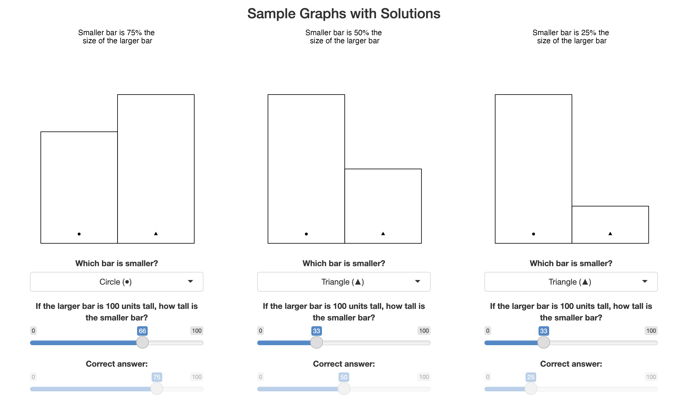
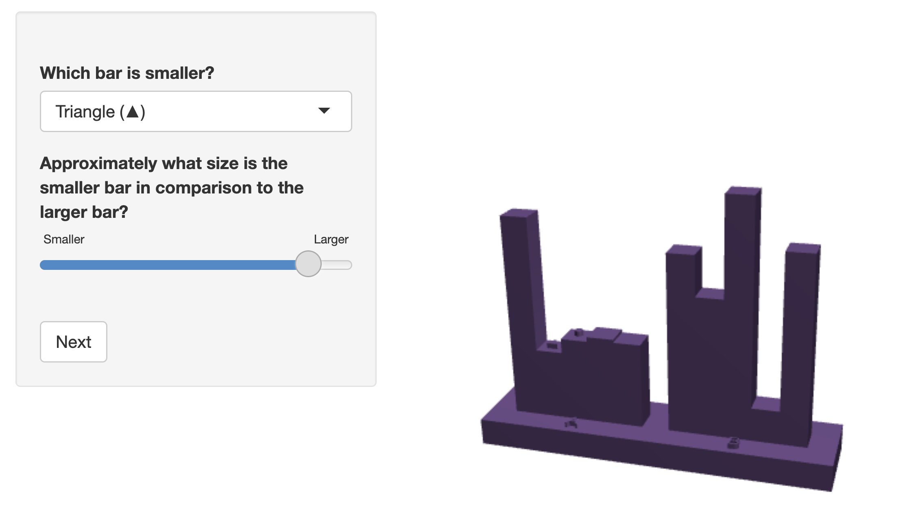

```{r, include = F}
knitr::opts_chunk$set(echo = F, dpi = 300, message =F, warning = F, error = F, dev = "ragg_png")

library(tidyverse)
library(RSQLite)
library(lme4)

con = dbConnect(SQLite(), '_data/department.db')
dbListTables(con)
results = dbReadTable(con, 'results')
users = dbReadTable(con, 'user')
userMatrix = dbReadTable(con, 'userMatrix')
dbDisconnect(con)

valid.users <- users %>% 
  mutate(subject = paste0(nickname, participantUnique)) %>% 
  filter(age != 'Under 19')


#Fill in correct values for incorrect 3d graph kits
# 1 result, need to fill in fileID, graphtype, and plot
results = results %>% 
  mutate(fileID = ifelse(graphCorrecter %in% 'id-01/Type1-Rep01', 1, fileID),
         graphtype = ifelse(graphCorrecter %in% 'id-01/Type1-Rep01', 'Type1', graphtype),
         plot = ifelse(graphCorrecter %in% 'id-01/Type1-Rep01', '3dPrint', plot))


load('_data/set85data.Rdata')
load('_data/kits.Rdata')


trueRatios = datasets %>% 
  mutate(ratio.df = map(data, function(x)(x[!is.na(x[,'IDchr']),4])),
         trueRatio = map(ratio.df, function(x)(x[1,'Height'] / x[2,'Height']))) %>% 
  unnest(trueRatio) %>% 
  filter(fileID != 15) %>% 
  #mutate(Height = Height * 100) %>% 
  select(fileID, Height)

res_all = results %>% 
  left_join(trueRatios, by = 'fileID') %>% 
  mutate(response = log2(abs(byHowMuch - Height*100) + 1/8),
         subject = paste0(nickname, participantUnique),
         ratioLabel = round(100*Height, 1)) %>% 
  filter(subject %in% valid.users$subject
         , as.Date.POSIXct(appStartTime) <= '2023-05-22'
         ) %>% 
  arrange(appStartTime)

valid.users <- valid.users %>% 
  filter(subject %in% res_all$subject)

res <- res_all %>% 
  filter(whichIsSmaller == 'Triangle (▲)'
         , as.Date.POSIXct(appStartTime) <= '2023-05-22'
         ) %>% 
  #Only verified results from before the start of SDSS 
  filter(!is.na(ratio))

```

# Introduction
Good communication requires both that the information be transmitted correctly and that the intended recipient be able to decode and understand the transmitted information accurately. In order to communicate effectively, we must use graphical forms that accurately convey information relevant to the task in question. In many cases, this means we must understand how accurately people can read quantitative information off of charts. While accuracy is not the only quantity of interest in graphical investigations [@hullmanPursuitErrorSurvey2019], it is an important factor in assessing the utility of many different data graphics.

The accuracy of graphical forms has been studied for almost a century [@vonhuhnFurtherStudiesGraphic1927;@eellsRelativeMeritsCircles1926;@croxtonGraphicComparisonsBars1932;@croxtonBarChartsCircle1927]; as new ways of representing information evolve, we must revisit old studies to determine whether these representations have the same limitations as previous versions. This is particularly true in areas like graphics which are affected by the immense technological innovation in hardware and software which has taken place since the early 1990s.

## Elementary Graphical Tasks
@clevelandGraphical1984 established the comparative accuracy of different "elementary perceptual tasks" (EPTs).
Elementary Perceptual Tasks, according to these experiments, include assessing graphical elements such as position along a common scale, length, angle, and volume, and estimating the corresponding numerical value of these representations.
The study relied entirely on estimation accuracy, which may not always be relevant when extracting information from graphs. For example, estimation is less relevant when ordering values by size.
As a result of the Cleveland and McGill [-@clevelandGraphical1984] study, it is possible to assemble an ordering of perceptual accuracy for the elements of length, position, and angle. 
@heerCrowdsourcingGraphicalPerception2010b replicated some parts of @clevelandGraphical1984 in an online setting using  Mechanical Turk, a platform for crowdsourcing human tasks that has been used for (among other things) assembling machine learning datasets. This replication study largely validated the results of the original study while demonstrating the utility of the Mechanical Turk platform for graphical testing.

The first experiment in @clevelandGraphical1984 (the position-length experiment), used five types of bar charts: two types of grouped bar charts and three types of stacked bar charts.
Each chart had two bars marked for comparison; participants were asked to determine which bar was smaller and give the  perceived ratio of the smaller bar to the larger bar. \Cref{fig:bar-types} shows the two types of grouped bar charts. 
We are primarily interested in the grouped bar charts (in part because 3D printing is not yet inexpensive enough to make moderate-scale stacked bar chart experiments viable), which consisted of two comparison bars which were either adjacent or in separate groups.
These grouped bar charts will be referenced as adjacent and separated graph types in this paper, respectively.

```{r bar-types}
#| fig-width: 4
#| fig-height: 4
#| fig-cap: "\\citet{clevelandGraphical1984} used two different types of grouped bar charts: comparisons between adjacent bars, and comparisons between separated bars. It is widely acknowledged that comparisons between separated bars (Type 3 comparisons, in Cleveland \\& McGill's terminology) are more difficult and error-prone."
#| out-width: ".49\\linewidth"
#| fig-show: "hold"
#| layout-ncol: 2
library(ggplot2)
library(ragg)
datasets$data[[1]] %>%
  ggplot(aes(x = Group, y = Height, group = GroupOrder)) + 
  geom_col(position = "dodge", fill = "white", color = "black") + 
  geom_point(aes(x = Group, y = 5, group = GroupOrder, shape = IDchr), size = 3, position = position_dodge(0.9)) + 
  guides(shape = "none") + 
  theme_bw() + 
  theme(axis.title = element_blank(), axis.text.x = element_blank()) + 
  ggtitle("Adjacent (Type 1)")


datasets$data[[1]] %>%
  ggplot(aes(x = factor(Order %%2), y = Height, group = GroupOrder)) + 
  geom_col(position = "dodge", fill = "white", color = "black") + 
  geom_point(aes(x = factor(Order %%2), y = 5, group = GroupOrder, shape = IDchr), size = 3, position = position_dodge(0.9)) +
  guides(shape = "none") + 
  theme_bw() + 
  theme(axis.title = element_blank(), axis.text.x = element_blank()) + 
  ggtitle("Separated (Type 3)")

```


## 3D Graphical Perception

Chart perception is affected by the human visual system's implicit assumption that visual stimuli are three-dimensional; after all, most of the visual input we process does come from a three-dimensional world, but charts are artificial. 
In addition, these artificial stimuli are typically created and presented in two dimensions.
The artificial scenes we create for data visualization have been documented to cause problems: for instance, the line-width illusion [@vanderplasSignsSineIllusion2015;@daySineIllusion1991;@hofmannCommonAnglePlots2013] has been attributed to implicit 3D perception of 2D stimuli and can affect perception of error bands, candlestick plots, hammock plots, and Sankey diagrams. The line width illusion causes lines or error bands which are actually the same length to appear shorter at points with large amounts of curvature; a simple example of the classic sine illusion (one version of the line width illusion) is shown in \Cref{fig:sine-illusion}. 
While this illusion is problematic in two dimensions, when the depth cues are actually present in a three-dimensional situation, the same implicit visual heuristics contribute to accurate size perception (as in the middle panel of \Cref{fig:sine-illusion}). 
Thus, there is reason to think that perceptual accuracy may be dependent on the realism of the visual display relative to the training of the visual system and the heuristics which are activated in order to make sense of the display. 


```{r sine-illusion}
#| message: false
#| error: false
#| warning: false
#| cache: false
#| fig-width: 4
#| fig-height: 4
#| out-width: "33%"
#| fig-cap: "An illustration of the sine illusion\\citep{vanderplasSignsSineIllusion2015}, also known as the line-width illusion. All vertical lines are the same length, but the lines in the middle of the curve appear to be much shorter. The illusion results when implicit perceptual corrections useful for perceiving the size of objects with depth are applied to 2D stimuli with no actual depth. As 3D heuristics occasionally cause inaccurate communication when applied to 2D objects, it is reasonable to think that there might be some situations where charts making use of a realistic third dimension might be perceived more accurately than their 2D equivalents."
#| fig-subcap:
#|    - "Sine Illusion"
#|    - "3D surface with similar features"
#|    - "Perceived vs. actual length"
#' Function to data frame
#'  
#' @param n number of values 
#' @param ell extent of vertical range
#' @param x range of horizontal values
#' @param f function
#' @param fp first derivative of function f
#' @param f2p second derivative of function f
#' @return data frame with n function values and derivatives along the x axis for a range given by x
#' @example
#' f <- function(x) 2*sin(x)
#' fp <- function(x) 2*cos(x)
#' f2p <- function(x) -2*sin(x)
#' dframe <- function.frame(n=50, ell=1, x=c(0,2*pi), f, fp, f2p)
#' require(ggplot2)
#' qplot(x, y=ystart, yend=yend, xend=x, geom="segment", data=dframe) +
#'    geom_point(aes(x,y))
function.frame <- function(n=200, ell=1, x, f, fprime, f2prime) {
  x <- seq(x[1], x[2], length=n)
  if (length(ell) != length(x)) ell <- rep(ell, length(x))
  y <- f(x)
  ystart <- y - ell/2
  yend <- y + ell/2
  # now correct for line illusion in vertical direction
  dy <- diff(range(y))
  dyl <- diff(range(c(ystart, yend)))
  # fprime and f2prime are sensitive to the aspect ratio of a plot
  # we represent it in framework of dy and dy+len
  # needs to be fixed by factor a:  
  a <- dy/dyl 
  
  fp <- a*fprime(x)
  f2p <- a*f2prime(x)
  data.frame(x,y,ystart, yend, fp, f2p, a)
}

#' This function has to be split in parts and renamed
#' 
#' Right now this function is a convoluted mess.  We need to have separate
#' functions that 
#' (1) create a data frame for a given function,
#' its first and second derivatives and range in x
#' (this is what the function function.frame is supposed to do), 
#' (2) a trig transform function
#' (3) a quadratic approach function - better even, make (2) and (3) one function and use a parameter to decide on the method to use.
#' @example
#' f <- function(x) 2*sin(x)
#' fp <- function(x) 2*cos(x)
#' f2p <- function(x) -2*sin(x)
#' dframe <- createSine(n=50, ell=1, x=c(0,2*pi), f, fp, f2p)
#' require(ggplot2)
#' qplot(x=x, xend=x, y=y+ellx4.u, yend=y-ellx4.l, geom="segment", data=dframe, linetype=I(1)) + 
#'    theme_bw() + coord_fixed(ratio=1) + 
#'    xlab("x") + ylab("y") + 
#'    scale_x_continuous(breaks=seq(0, 2*pi, by=pi/2), minor_breaks=minor.axis.correction,
#'      labels=c("0", expression(paste(pi,"/2")), expression(pi), expression(paste("3",pi, "/2")), 
#'      expression(paste("2",pi))))

createSine <- function(n=200, len=1, f=f, fprime=fprime, f2prime=f2prime, a=0, b=2*pi) {
  #  if(getquadapprox & !is.function(f2prime)) f2prime <- function(x) -1*f(x) # for backwards compatibility
  x <- seq(a, b, length=n+2)[(2:(n+1))]
  ell <- rep(len, length=length(x))
  fx <- f(x)
  ystart <- fx - .5*ell
  yend <- fx + .5*ell
  
  # now correct for line illusion in vertical direction
  dy <- diff(range(fx))
  dx <- diff(range(x))
  # fprime works in framework of dx and dy, but we represent it in framework of dx and dy+len
  # needs to be fixed by factor a:  
#  a <- dy/(dy + len) 
  dyl <- diff(range(c(ystart, yend)))
  a <- dy/(dyl) 
  # ellx is based on the "trig" correction
  ellx <- ell / cos(atan(abs(a*fprime(x))))
  # ellx2 is based on linear approximation of f  
  ellx2 <- ell * sqrt(1 + a^2*fprime(x)^2)
  
  # make this a data frame - ggplot2 doesn't do well with floating vectors
  dframe <- data.frame(x=x, xstart=x, xend=x, y=fx, ystart=ystart, yend=yend, ell=ell, ellx = ellx, ellx2=ellx2)
  
  # third adjustment is based on quadratic approximation of f.
  # this needs two parts: correction above and below f(x)  
  #   if(getquadapprox & is.function(f2prime)){
  #     secseg <- do.call("rbind", lapply(dframe$x, function(i) getSecantSegment(i, dframe, f, fprime, f2prime)))
  #     dframe$ellx3.u <- secseg$sec.ell1
  #     dframe$ellx3.l <- secseg$sec.ell2
  #   }
  
  fp <- a*fprime(x)
  f2p <- a*f2prime(x)
  v <- 1 + fp^2
  lambdapinv <- 0.5*(sqrt(v^2-f2p*fp^2*ell) + v)    
#  lambdaminv <- -0.5*(sqrt(v^2+f2p*fp^2*ell) + v)
  lambdaminv <- 0.5*(sqrt(v^2+f2p*fp^2*ell) + v)
  
  dframe$ellx4.l <- 0.5*abs(lambdapinv)/sqrt(v)
  dframe$ellx4.u <- 0.5*abs(lambdaminv)/sqrt(v)
#  dframe$lambdam <- 1/lambdaminv
#  dframe$lambdap <- 1/lambdapinv
  fp <- fprime(x)
  f2p <- f2prime(x)
  v <- 1 + fp^2
#  lambda1 <- (-v + sqrt(v^2 - fp^2*f2p*ell))/(fp^2*f2p) # these two work
#  lambda2 <- (-v + sqrt(v^2 + fp^2*f2p*ell))/(fp^2*f2p) # these two work

  lambdaa <- -2*(sqrt(v^2 - f2p*fp^2*ell) + v)^-1 # identical to top
  lambdab <- 2*(sqrt(v^2 + f2p*fp^2*ell) + v)^-1

  dframe$lambdam <- lambdaa
  dframe$lambdap <- lambdab
   
  # qplot(a*(sqrt(1 + a^2*fprime(x)^2)*abs(lambdab))^-1, ellx4.u, data=dframe)
  # qplot(a*(sqrt(1 + a^2*fprime(x)^2)*abs(lambdaa))^-1, ellx4.l, data=dframe)
  # ggplot(aes(x, y+ell*(a*sqrt(v)*abs(lambdaa))^-1, xend=x, yend=y-ell*(a*sqrt(v)*abs(lambdab))^-1), data=dframe) + geom_segment()  
     
  dframe
}

#' what is the function doing? - in one sentence
#' 
#' function description in a paragraph
#' @param x0 is a vector of locations for which the secant segments are supposed to be calculated
#' @param df df is a data frame
#' @param f function
#' @param fp first derivative of function f
#' @param f2p second derivative of function f
#' @return data frame consisting of .... what is the output of the function?
#' @example
#' # need an example here of how to use the function
getSecantSegment <- function(x0, df, f, fprime, f2prime){
# find the closest values of the grid df corresponding to x0
  # doesn't work right now
  ell.x0 <- sapply(x0, function(x) df$ell[which.min(x-df$x)])

  dy <- diff(range(with(df, c(y+ell.x0, y-ell.x0))))
  dx <- diff(range(df$x))
  a <- dx/dy
  
  #---- Actual Roots
  #   secSlope   <- -a/fprime(x0)
  #   temp       <- seq(min(df$x)-pi, max(df$x)+pi, .0001)
  #   leftend    <- temp[which.min(abs(f(temp) + ell.x1 - secSlope*(temp-x1)))]
  #   rightend   <- temp[which.min(abs(f(temp) - ell.x1 - secSlope*(temp-x1)))]
  #----
  
  #---- Approximation
  lambda1 <- (-(fprime(x0)^2 + 1) + sqrt((fprime(x0)^2 + 1)^2 - 2*fprime(x0)^2*f2prime(x0)*ell.x0))/(fprime(x0)^2*f2prime(x0))
  lambda2 <- (-(fprime(x0)^2 + 1) + sqrt((fprime(x0)^2 + 1)^2 + 2*fprime(x0)^2*f2prime(x0)*ell.x0))/(fprime(x0)^2*f2prime(x0))
  
  x1 <- lambda1*fprime(x0)+x0
  x2 <- lambda2*fprime(x0)+x0
  y1 <- f(x0)-lambda1
  y2 <- f(x0)-lambda2
  #----
  
  #---- Approximation V2 ----
  #   dx <- fprime(x0)
  #   dx1 <- 1+dx^2   
  #   ddx <- f2prime(x0)
  #   
  #   corr1 <- 1/a*(((dx1)-sqrt(dx1^2-2*ddx*(dx1-1)^2*ell.x0))/(ddx*dx))
  #   corr2 <- 1/a*(((dx1)-sqrt(dx1^2+2*ddx*(dx1-1)^2*ell.x0))/(ddx*dx))
  #   if(abs(dx)<.01) {
  #     dx1 <- 2
  #     corr1 <- corr2 <- 0
  #   }
  #   if(abs(dx)<.01){
  #     ddx <- 1
  #   }
  #   
  #   x1 = corr1 + x0
  #   x2 = corr2 + x0
  #   y1 = f(x1)+ell.x0
  #   y2 = f(x2)-ell.x0
  #---- 
  
  df2 <- data.frame(x=x0, y=f(x0), deriv=fprime(x0),
                    sec.xstart=x1, sec.xend = x2, 
                    sec.ystart=y1, sec.yend = y2,
                    ell.orig = 2*ell.x0)
  
  df2$sec.ell1 <- a*.5*ell.x0/with(df2, sqrt((sec.yend-y)^2+(sec.xend-x)^2))
  df2$sec.ell2 <- a*.5*ell.x0/with(df2, sqrt((y-sec.ystart)^2+(x-sec.xstart)^2))
  #   df2$sec.ell1 <- with(df2, sqrt((sec.yend-y)^2+(sec.xend-x)^2))
  #   df2$sec.ell2 <- with(df2, sqrt((y-sec.ystart)^2+(x-sec.xstart)^2))
  df2$type <- "Perceived Width"
  df2$a <- a
  return(df2)
}

correctx <- function(z, fprime, a=0, b=2*pi, w=1) {
  # w = 1/(shrink+1)
  const <- integrate(function(x) abs(fprime(x)), a, b)$value
  trans <- sapply(z, function(i) integrate(function(x) abs(fprime(x)), a, i)$value*(b-a)/const + a)
  # alternatively to the rowMeans, you could report back  
  # trans*(1-w) + z*w
  trans*w + z*(1-w)
}

f <- function(x) 2*sin(x)
fprime <- function(x) 2*cos(x)
f2prime <- function(x) -2*sin(x)

x <- seq(0, 2*pi, length=42)[2:41]
data <- do.call("rbind", lapply(seq(-.5, .5, 1), function(i) data.frame(x=x, y=3*sin(x), z=i)))

data.persp <- reshape2::acast(data, x~z, value.var="y")
x <- sort(unique(data$x))
y <- sort(unique(data$y))
z <- sort(unique(data$z))
dframe <- createSine(n = 50, len = 1, f=f, fprime=fprime, f2prime=f2prime)
dframe %>%
  ggplot(aes(x = xstart, xend = xend, y = ystart, yend = yend)) + geom_segment() + coord_fixed() + 
  theme_void()

par(mar = c(0, 0, 0, 0))
persp(x, z, data.persp,  xlab="", ylab="", zlab="", theta=0, phi=45, border="black", shade=.35, col="white", xlim=c(-pi/12, 2*pi+pi/12), ylim=c(-1, 1), scale=FALSE, box=FALSE, expand=2.5/pi, d=50) # , ltheta=0, lphi=-15

# persp(x, z, data.persp,  xlab="", ylab="", zlab="", theta=0, phi=45, border="black", shade=.35, col="white", xlim=c(-pi/12, 2*pi+pi/12), ylim=c(-1.75, 1.75), scale=FALSE, box=FALSE, expand=3/pi, d=3) # , ltheta=0, lphi=-15

dframe <- createSine(n = 150, len = 1, f=f, fprime=fprime, f2prime=f2prime)
dframe$ystartcts <- dframe$ystart
dframe$yendcts <- dframe$yend
dframe[1:150,c(2, 3, 5, 6)] <- NA
dframe[(1:15)*10-5, c(2, 3)] <- dframe[(1:15)*10-5, 1] 
dframe[(1:15)*10-5, 5] <- dframe[(1:15)*10-5, 4] - .5
dframe[(1:15)*10-5, 6] <- dframe[(1:15)*10-5, 4] + .5
dframe$type <- "Vertical Width"

idx <- which(!is.na(dframe$xstart))
dframe$ell <- dframe$ell/2
dframe.1 <- getSecantSegment(dframe$xstart[idx], dframe, f, fprime, f2prime)
dframe.1$x <- dframe$x[idx]
dframe.1$y <- dframe$y[idx]
dframe.1$ystartcts <- dframe$ystartcts[idx]
dframe.1$yendcts <- dframe$yendcts[idx]
names(dframe.1) <- c("x", "y", "deriv", "xstart", "xend", "ystart", "yend", "ell", "ell.quad1", "ell.quad2", "type", "a", "ystartcts", "yendcts")
dframe.1$vangle <- with(dframe.1, atan(deriv))
dframe <- bind_rows(dframe, dframe.1)
dframe$type <- factor(dframe$type)

ggplot(aes(x=x, y=y), data=dframe, colour=I("grey50")) + 
  geom_line(color = "grey") + theme_void() + 
  geom_line(aes(y=ystartcts), colour="grey50", alpha = .25) +
  geom_line(aes(y=yendcts), colour="grey50", alpha = .25) +
  geom_segment(data=subset(dframe, !is.na(type)), 
               aes(x=xstart, xend = xend, y=ystart, yend=yend, colour=type, linetype=type), linewidth=0.8)  + 
  xlab("") + ylab("")  +
  coord_equal(ratio=1) + scale_colour_manual("", values=c("blue", "grey30")) + 
  # geom_text(aes(label=paste("theta", "%~~%", round(abs(vangle)/pi*180), "^o", sep=""), 
                # x=pmax(xstart, xend)/2+x/2+.35 , y=y-sign(vangle)*.6+.02), colour="blue",
            # data=dframe.1, parse=TRUE, hjust=.9, vjust=.5, size=3) + 
  scale_x_continuous(breaks=seq(0, 2*pi, by=pi/2), 
                     labels=c("0", expression(paste(pi,"/2")), expression(pi), 
                              expression(paste("3",pi, "/2")), expression(paste("2",pi)))) +
  scale_linetype_manual("", values=c("11", "solid")) + 
  theme(legend.key.width = unit(3, "line"), plot.margin = unit(c(0,0,0,0), "cm"), legend.position=c(.25, .2)) 


```


The use of 3D graphics have been explored in multiple studies, with mixed results. 
@fisher_data_1997 explored user preference for 2D or 3D charts and found that subjects tended to prefer simpler 2D graphs when tasked with extracting information. 
@barfield_effects_1989 compared 2D and 3D graphs presented on paper and on computers, showing that the accuracy of subject answers depended on their skill level: novice subjects were more accurate with 2D paper graphs, while experienced managers were more accurate with 3D computer graphs. 
For both experience levels, participants were more confident in their answers when using 2D graphs. 
There are instances where 2D graphs perform better than 3D graphs, but there are times where 3D graphs may provide a more natural way to encode information, at least in theory. For instance, when X and Y are used to represent spatial dimensions, it may be preferable to use a 3D chart to convey numerical information instead of using color, which is perceived much less accurately. 
@brath_3d_2014 highlights the intrinsic attributes of 3D graphs and the benefits when used appropriately with other 3D elements such as lighting and correct portrayal of data attributes.
Nevertheless, it is extremely common in visualization literature to recommend that 3D plots be avoided at all costs [@vanderplasTestingStatisticalCharts2020;@wilkeDonGo3D2020;@morganwallIntroducing3DGgplots20191006]. 

There is thus good reason to be wary of the use of three dimensions where only two are necessary to convey data [@huffHowLieStatistics1954]. 
However, the situation is different now than it was in 1984 when Cleveland \& McGill published their seminal work; it has even changed since Heer's replication study [-@heerCrowdsourcingGraphicalPerception2010b] in 2010.  
Computer graphics and rendering technology have developed quickly, along with the hardware necessary to support these software developments. 
As a result, we have much more natural virtual rendering of 3D objects, and we can also print graphics in three dimensions using mass-market, relatively inexpensive 3D printers, moving artificial charts into a more natural, physical setting.
As a result, it is reasonable to reconsider the use of 3D charts, not only because of new technological developments, but also because 3D printed charts could eventually provide the opportunity to make data graphics accessible to those with limited or absent vision [@fleetHowTactileGraphics2023].


In this paper, we discuss a study designed to examine Cleveland & McGill's experiments on grouped bar charts using modern graphics in two and three dimensions. This study lays the groundwork for additional empirical studies on the use of 3D graphics, rendered and 3D printed, for visualizing complex data. In order to explore perception of fully 3D graphics, it is prudent to start with the simplest possible 3D graphic: one in which the third dimension is not necessary, so that we can easily compare to two-dimensional representations without loss of information. <!-- This is included because of a graphics paper section comment that really annoyed me -->
In the next section we provide details about design and execution of our experiment, including the process of replicating stimuli from @clevelandGraphical1984 in order to create 2D, 3D projected, 3D rendered, and 3D printed bar graphs. The next section presents the results, and we conclude the paper by discussing this experiment in the context of existing work on the perception of 2D and 3D graphical elements. 


# Methods


Our study is designed to replicate and expand upon the position-length experiment from Cleveland & McGill as closely as possible, with the hope of being able to integrate this study with previously reported results in a consistent manner. 
In this section, we discuss the replication process and the design of our version of this experiment.

## Replicating Cleveland and McGill

The first step of replicating the position-length experiment was to determine the heights of the bars that  participants use for comparisons.
These values for the bar heights are linear on a log scale and are given by

\[s_i=10\cdot 10^{(i-1)/12}, \qquad i=1,...,10\]


Each graph presents two bars from the values given above where the participants are asked to judge the ratio of the smaller bar to the larger bar. The ratio of bars used by Cleveland and McGill were 17.8, 26.1, 38.3, 46.4 (twice), 56.2, 68.1 (twice), and 82.5 (twice).
The exact numeric comparisons were not disclosed, but the comparison values used in our study were subjected to the constraints of having the same ratio values and that no value was used more than twice.

```{r experiment-values}
library(papaja)
extract_values <- function(data){
  data %>% 
    dplyr::filter(!is.na(IDchr)) %>% 
    dplyr::select(Height)
}

datasets %>% 
  mutate(setID = str_extract(file, 'id-[0-9]{2}')) %>% 
  filter(fileID < 15) %>% 
  mutate(vals = map(data, extract_values)) %>% 
  unnest(vals) %>% 
  mutate(Height = round(Height,1)) %>% 
  group_by(fileID) %>% 
  mutate(Bar = ifelse(Height == min(Height), 'Smaller', 'Larger')) %>% 
  ungroup() %>% 
  select(fileID, Height, Bar, setID) %>% 
  filter(fileID %% 2 == 1) %>% 
  mutate(setID = paste0('ID: ', str_remove(setID, 'id-'))) %>% 
  select(-fileID) %>% 
  pivot_wider(names_from = Bar, values_from = Height) %>% 
  mutate(`Ratio (%)` = round(Smaller/Larger,3)*100) %>% arrange(`Ratio (%)`) %>% 
  pivot_longer(Smaller:`Ratio (%)`, values_to = 'Height', names_to = 'Bar') %>% 
  pivot_wider(names_from = setID, values_from = Height) %>% 
  apa_table(caption = 'Values used in the experiment to make ratio comparisons, sorted by ratio. The ID label corresponds to the file reference number.') 

```


In each graph, there are two sets of five bars each, and two of the bars are marked for identification with a circle and triangle, as in \Cref{fig:bar-types}.
Cleveland and McGill did not specify the random process for the heights of the eight other bars, so we used a scaled Beta distribution to provide random structure around our fixed values.
Code to reproduce the data generation process, data underlying the plots used in this study, the rendered plots and STL files, anonymized user data, and analysis code can found be at [https://github.com/TWiedRW/2023-JDS-3dcharts](https://github.com/TWiedRW/2023-JDS-3dcharts). 

## Stimuli Construction

The graphs share a common layout across all formats, where two groupings of five bars are identified by "A" and "B", respectively, and circles and triangles are used to identify the bars participants should compare. Example graphs are shown in
\Cref{fig:plotTypes}.
There are some graphical elements that cannot be easily portrayed via 3D printing. For this reason, all graph types do not have axes, grid lines, or floating titles.
<!-- The aspect ratio of the plots presented in the original paper is approximately 0.825:1. The aspect ratio of the plots presented in our study is closer to 0.864:1, but -->
<!-- The aspect ratio of the 2d plots (including only the bars is 2:1), while the aspect ratio of the 3d printed charts is 11:9.5. This is something we probably need to fix.... Until then, let's not go there -->

```{r plotTypes, fig.cap = "Two dimensional, 3D digital rendering, and 3D-printed charts used in this study.",out.width = c("30%", "30%", "35%"), fig.show = "hold"}
knitr::include_graphics("_images/Type1-Rep01.png", dpi = 300)
knitr::include_graphics("_images/RenderedChart.png", dpi = 300)
knitr::include_graphics("_images/Kit_of_charts.png", dpi = 300)
```

The ggplot2 [@ggplot2] package was utilized to create the 2D bar charts. 
The scale axis was removed, leaving only the bars and a bar grouping identifier.
The bars used for comparisons had the identifying mark at a height of 5 out of 100 for the 2D plots, and the 3D plots had the identifying marks on top of the bars.

The 3D renderings and 3D printed charts were both created using OpenSCAD [@kintelOpenSCADDocumentation2023], which creates STL files from markup describing the object's geometric composition. 
Charts were composed of a platform, with raised text labels centered in front of the A and B groups of bars. Bars were created by inserting bar heights into the OpenSCAD template using R, and then raised circle and triangle markers were positioned on top of the bars to be compared to provide a tactile and visual indicator.
In addition, an ID code was engraved into the bottom of the platform to uniquely identify each object; this allowed the researchers to ensure that each kit contained the correct charts throughout the experiment while minimizing the risk of stickers or other identifiers becoming detached from the charts.
As printed, the base of each chart was 13cm x 3cm x 1cm, with the highest bar rising 9.5cm above the chart base.
Raised letters and shapes were 2mm above the base or bar, respectively.
The color of the filament used to print each chart corresponded to the estimation ratio (though this was not obvious to participants), allowing the researchers to quickly determine that a kit of 3D charts contained no ratio duplication.
Colors were randomly assigned to ratios so that participants could not gain information about the ratio from any perceived ordering of the colors. 

Digital renderings of the generated STL files were created using RGL [@rgl], which integrates into Shiny [@shiny] using the WebGL [@mozillafoundationWebGL2D3D2023] extension.
The RGL rendering of the STL file was initially angled to correspond to the perspective of default 3D bar charts present in Microsoft Excel, but in the WebGL interactive environment, participants could rotate the charts as they pleased to create a useful estimate of the bar ratio. 
Rendered charts were colored to correspond with the filament color used to print the physical chart for consistency.
The default `rgl` lighting was replaced with three lights located in fixed positions around the rendered figure. 
The lights were positioned so that one was behind the rendered figure<!--(x: 910, y: -1000, z:1000)-->, another in front of the figure<!--(x: 780, y: 1030, z: 1000)-->, and one light below the figure<!--(x: 65, y: 15, z: -100)-->.
This arrangement provided a consistent visual experience and minimized shadows that prevented visual estimation of the bars.


## Experiment Design

A diagram of the experimental design is provided in \Cref{fig:studyDesign}. The study is set up as a modified randomized incomplete block design, comprised of 3 blocks (presentation mode) and 7 bar ratios (5 are selected for each participant). At each combination of ratio and presentation type, the comparison type, adjacent (Type 1) or separated (Type 3), is randomly selected. This process was used to create 21 kits of 5 3D printed charts and 10 virtual charts. There is thus a slight deviation from a completely randomized incomplete block design, in that all possible combinations of ratios, presentation modes, and comparison types are not present in our design. However, this approach provided the best experimental design given the constraints of managing physical stimuli; it took nearly a month of continuous 3D printing to create all of the charts for the kits that we assembled. A dataset containing the kit composition breakdown is available in the github repository for this project.

<!-- There are 21 kits in total so that each combination of ratios is accounted for. -->
<!-- Each graph is randomly assigned either an adjacent or separated comparison. -->

```{r studyDesign, fig.cap = "A graphical representation of the study design. Only five of the seven ratios were used in each kit; at least one of the smallest or largest ratios were included along with 4 other charts; each selected ratio was displayed in all 3 mediums. For each medium $\\times$ ratio combination, the comparison type (separated or adjacent) was randomly determined. A total of 21 kits of 3D printed charts were created to include all combinations of the five ratios."}
knitr::include_graphics("_images/design.pdf")
```


## Participant Recruitment

One interesting facet of @clevelandGraphical1984 is the participant recruitment methodology: "For each experiment the subjects fell into two categories: (1) a group of females, mostly housewives, without substantial technical experience; (2) a mixture of males and females with substantial technical training and working in technical jobs. 
Most of the subjects in the position-length experiment participated in the position-angle experiment; in all cases repeat subjects judged the position-angle graphs first." 
It seems likely that the authors recruited individuals within their respective departments as well as their wives.
In order to replicate this atypical participant recruitment method in the modern era, members of the UNL Statistics department and their spouses, partners, and roommates were asked to participate in our study. 
This replicates the spirit of the recruitment method without the implicit assumptions that graduate students and professors are male, heterosexual, and have unemployed spouses.
A total of `r nrow(valid.users)` participants completed our study; demographics are shown in \Cref{fig:demographics}.


```{r demographics, fig.cap="Demographic characteristics of participants in the study.", message=FALSE, warning=FALSE, out.width='100%', fig.width = 9, fig.height = 3.5, cache = F}
library(patchwork)
valid.users$userAppStartTime <- as.POSIXct(valid.users$userAppStartTime,
           origin = '1970-1-1')

age.levels = sort(unique(valid.users$age))
p1 = valid.users[valid.users[,'userAppStartTime'] <= '2023-05-22',] %>% 
  group_by(age) %>% 
  summarise(count = n()) %>% 
  ggplot(mapping = aes(x = factor(age, levels = rev(age.levels)), y = count)) + 
  geom_bar(stat = 'identity') +
  geom_text(aes(x = factor(age, levels = age.levels), y = count+.5, label = age), hjust = 0) + 
  coord_flip() + 
  labs(title = 'Age', y = 'Count') +
  theme_bw() + 
  scale_y_continuous(expand = expand_scale(mult = 0, add = c(.25, 4))) + 
  theme(axis.title.y = element_blank(), axis.text.y = element_blank(), axis.ticks.y = element_blank())


p2 = valid.users[valid.users[,'userAppStartTime'] <= '2023-05-22',] %>% 
  group_by(gender) %>% 
  summarise(count = n()) %>% 
  ggplot(mapping = aes(x = gender, y = count)) + 
  geom_bar(stat = 'identity') +
  geom_text(aes(x = gender, y = count + .5, label = gender), hjust = 0) + 
  coord_flip() + 
  labs(title = 'Gender', y = 'Count') +
  theme_bw() + 
  scale_y_continuous(expand = expand_scale(mult = 0, add = c(.25, 4))) + 
  theme(axis.title.y = element_blank(), axis.text.y = element_blank(), axis.ticks.y = element_blank())


educ.levels = sort(unique(valid.users$education))[c(2,4,3,1)]
p3 = valid.users[valid.users[,'userAppStartTime'] <= '2023-05-22',] %>% 
  group_by(education) %>% 
  summarise(count = n()) %>% 
  ggplot(mapping = aes(x = factor(education, levels = educ.levels), y = count)) + 
  geom_bar(stat = 'identity') +
  coord_flip() + 
  geom_text(aes(x = education, y = count + .5, label = str_replace(education, "Graduate Degree", "Graduate\nDegree")), hjust = 0) + 
  scale_y_continuous(expand = expand_scale(mult = 0, add = c(.25, 15))) + 
  theme_bw() + 
  theme(axis.title.y = element_blank(), axis.text.y = element_blank(), axis.ticks.y = element_blank()) +
  labs(title = 'Education', y = 'Count') 

p = p1 + p2 + p3
p
```

While the results of any sample with recruitment methodology like this are not generalizable to the public, running our initial study on a comparable population to that of the initial study serves a purpose: other replications, such as @heerCrowdsourcingGraphicalPerception2010b, used online samples of paid participants, who likely have less experience using charts and graphics and making numerical estimations than those in a statistics department (and individuals who cohabitate with them). We have every intention of running this experiment in other populations, but the convenience of online sampling is not compatible with physical objects such as our 3D printed charts, so we will have to recruit in-person participants. Thus, an initial study in a population comparable to @clevelandGraphical1984 is a reasonable first step into testing 3D charts.  


## Data Collection

A Shiny applet was used for data collection, along with the provided kit of 3D printed charts.
Participants provided informed consent through the applet, and then were asked for demographic information (age, gender, education level). 
Then, participants were shown a "practice" page which allowed them to experiment with the data collection interface and practice estimating the ratio between the bars, as shown in \Cref{fig:practice}. This practice interface did not provide any numeric feedback as to participant correctness, but was merely intended to familiarize the participants with the questions which would be asked as well as the process of estimating the ratio between the two bars.

```{r practice, fig.cap = "Screenshot of Shiny application practice screen. Three 2D bar charts with different ratios were provided, along with sliders indicating the correct proportion. Participants could practice with the sliders and preview the questions that would be asked as part of the task.", out.width = "80%"}

```

After the practice screen, participants were asked to provide the kit ID. Participants were also instructed that when indicated, they should choose a 3D chart from the kit and select the ID code of the chart (inscribed on the bottom) from the drop-down menu before completing the estimation task. 
Participants were also instructed to make quick judgements for each graph and not to measure or estimate ratios using physical objects.

```{r experiment3dRender, fig.cap = "Screenshot of the applet collecting data for a 3D rendered chart task. Participants were asked to select which bar (circle or triangle) was smaller, and then to estimate the ratio of the smaller bar to the larger bar.", out.width = "80%"}

```

Each graph (or prompt, in the case of 3D printed charts) in the applet had two corresponding questions for participants to answer: first, participants were to identify the smaller bar by shape, and then, participants were to estimate the ratio of the size of the smaller bar to the size of the larger bar, as shown in \Cref{fig:experiment3dRender}. 
It should be noted that we chose to use a slider without numeric identifiers or tick marks for entering ratio estimates - in part, this was intended to alleviate rounding effects which occur when participants enter numbers on their own or get numeric feedback from slider entries [@ruudUncertaintyCausesRounding2014a;@maineriSliderBarsMultiDevice2021]. 
Another benefit of this modification is that it should reduce participants' cognitive load, allowing them to focus on the ratio between bars rather than the numerical translation process.
This differs from @clevelandGraphical1984, but maintains the spirit of the study while using methods which were not available for data entry at the time. 

```{r, include = F}
res %>%
  group_by(subject, ratio) %>%
  summarize(mean = mean(byHowMuch), sd = sd(byHowMuch))
  
```


# Results

```{r, include = F}
res_sub_count <- res_all %>% 
  group_by(nickname, participantUnique, appStartTime, subject) %>% 
  count()
```


The participants provided a total of `r nrow(res_all)` responses.
While each participant was provided with 15 trials, `r sum(res_sub_count$n < 15)` participants partially completed the experiment; one participant did not advance beyond the demographic page. 
All responses that incorrectly identified the smaller bar ($n = `r nrow(res_all) - nrow(res)`$) were removed from the study before analysis; this serves as a basic attention check and leaves `r nrow(res)` valid responses. 
In addition, one response was removed because the participant did not enter a valid ID for a 3D printed chart.


## Midmeans of Log Absolute Errors
\citeauthor{clevelandGraphical1984} used 
$$\log_2(|\text{Judged Percent} - \text{True Percent}|+1/8)$$
to measure accuracy of their participant's responses. 
In their study, log base 2 seemed appropriate due to "average relative errors changing by factors less than 10."
They also added 1/8 to prevent distortions when the errors were close to zero. 
@heerCrowdsourcingGraphicalPerception2010b followed the same analysis method, replicating many (but not all) of the results presented in the original paper.

\Cref{fig:midmeans-log-errors} shows the midmeans of the log absolute errors compared to the true ratio of the bars for each graph type and comparison type. 
The results suggest that the log absolute errors increase for greater differences between the smaller and larger bars, but are consistent across the graph types. 

```{r midmeans-log-errors, fig.cap='Midmeans and observed values of log absolute errors for the true ratio of bars. Summary lines are computed from raw data using a loess smooth.', message=FALSE, warning=FALSE, out.width='\\textwidth', fig.height=3}
plot.types = c('2D', 'Rendered 3D', '3D Printed')
names(plot.types) = c('2dDigital', '3dDigital', '3dPrint')


tmp <- res %>% 
  group_by(Height, graphtype, plot) %>% 
  summarize(midmean = mean(response, trim=0.25, na.rm = T)) %>%
  mutate(type = "Midmean") %>%
  rename(response = midmean)


res %>% 
  mutate(type = "Raw Data") %>%
  bind_rows(tmp) %>%
  # group_by(Height, graphtype, plot) %>% 
  ggplot(mapping = aes(x = Height*100, y = response,
                       color = graphtype, fill = graphtype)) +
  geom_smooth(se = T, alpha=.125,  expand = F, method = "loess") +
  geom_point(aes(shape = type, alpha = type, size = type)) +
  scale_shape_manual("Data", values = c(19, 1)) + 
  scale_size_manual("Data", values = c(2, 1)) + 
  scale_alpha_manual("Data", values = c(1, .25)) + 
  scale_fill_discrete(labels = c('Adjacent', 'Separated')) +
  scale_color_discrete(labels = c('Adjacent', 'Separated')) +
  scale_x_continuous(limits = c(0, 100)) + 
  facet_wrap(~plot, labeller = labeller(plot = plot.types)) +
  labs(title = '',
       x = 'True Proportional Difference (%)',
       y = 'Log Error',fill = 'Comparison Type',
       color = 'Comparison Type') +
  theme_bw() +
  theme(legend.position = 'bottom')
```
This is somewhat different than the results in @clevelandGraphical1984 and @heerCrowdsourcingGraphicalPerception2010b; in both cases the midmean log absolute errors increased until about 55% of the true proportional difference and then decreased.
It is possible that this difference is due to the fact that we did not require an explicit numerical estimate of the ratio but instead asked participants to indicate the ratio on a slider (which is essentially a number line). 
It is possible that this change explains the lack of a difference between chart modalities we see, but there are other potential explanations as well. 
One interesting facet of this data is that there is a consistent reduction in log error when the true proportional difference is near 50%. 
This may be because of implicit anchoring - we can typically bisect a span relatively accurately, which means that it might be expected that when the true proportion is near 50%, we would both notice that and be able to accurately transfer that information to the slider. 
This pattern is more noticable in separated (Type 3) comparisons, which also makes sense - as these comparisons are known to be less accurate, a locally  minimal error near 50% with increased error relative to adjacent (Type 1) comparisons could easily explain the exaggerated trends we see in \Cref{fig:midmeans-log-errors}.

## Generalized Additive Model

In addition to replicating the (primarily graphical) analysis of participant errors, we also took a more statistical approach and fitted a generalized additive model [@hastie2017generalized] that accounts for participant variation as well as the effect of comparison type, graph type, and ratio. 

We define the following effects:

- $R$, the numerical ratio of A/B where A is the length of the smaller bar and B is the length of the larger bar. There are $i=1, ..., 7$ levels of $R$ in this study, but we will treat $R$ as a numeric variable throughout this model.

- $D_j$, the display mode, where $j = 1, 2, 3$ correspond to 2D, 3D rendered, and 3D printed charts respectively.

- $T_k$, the type of comparison, where $k = 1, 2$ correspond to adjacent (Type 1) and separated (Type 3) comparisons, respectively

- $P_l$, a random effect for participant which describes the overall skill of the participant at visual estimation of ratios.

Generalized additive models depend on a smooth function $s(): \mathbb{R}\rightarrow\mathbb{R}$ which is applied to the independent variables; by default, the smooth function is created using thin-plate regression splines. In place of an interaction term when a categorical variable is involved, separate smooths are fit for each level of the categorical variable; we will indicate this by subscripting the smooth function with the categorical variable index, so that $s^T_1(R)$ indicates the smooth over numerical variable $R$ for the 1st level of the categorical variable T, that is, the smooth function over $R$ for adjacent comparisons.

Then the formal statistical model is as follows:

$$y= s^D_j(R) + s^T_k(R) + D_j + T_k + P_l + \epsilon$$

\noindent where

- $y=\log_2(|\text{Judged Percent}_{ijkl} - \text{True Percent}_{ij}|+1/8)$

- $s^D_j(R)$ is a thin-plate spline function for R accounting for the display type

- $s^T_k(R)$ is a thin-plate spline function for R accounting for the comparison type

- $D_j$ is the fixed effect of the display type (e.g. an intercept term)

- $T_k$ is the fixed effect of the $k^{th}$ comparison type

- $P_l$ is the random effect of the $l^{th}$ participant

- $\epsilon$ is the random error

```{r gam}
library(mgcv)
library(gratia)
res2 <- res %>%
  mutate(participant = factor(as.numeric(factor(subject)))) %>%
  mutate(ratio_prop = ratioLabel/100) %>%
  mutate(type = factor(type, levels = 1:2, labels = c("Separated", "Adjacent"))) %>%
  mutate(plot = factor(plot)) %>%
  mutate(plottype = interaction(plot, type))
# res2

gam_mod <- gam(response ~ 
                 s(ratio_prop, by = plot, k = 6) +
                 s(ratio_prop, by = type, k = 6) + 
                 plot + type + 
                 s(participant, bs = "re"),
               data = res2, method = 'REML')
# gam_mod

gam_sum <- summary(gam_mod)
```

```{r, results = 'asis'}
gam_sum$p.table %>% knitr::kable(digits = 4, caption = "Parametric coefficients in gam model.", label = "gam-param", booktabs = T)

gam_sum$s.table %>% as.data.frame() %>% 
  mutate(Smooth = rownames(.),
         Smooth = str_replace(Smooth, "ratio_prop", "Ratio")) %>%
  select(Smooth, everything()) %>%
  knitr::kable(digits = 4, row.names = F, caption = "Approximate significance of smooth terms in gam model.", label = "gam-smooth", booktabs = T)
```

A generalized additive model with random effects for subject was fit using the `mgcv` package [@mgcv1;@mgcv2;@mgcv3]. Spline terms by comparison type and display type were included for the ratio variable, to account for indications of nonlinearity from \Cref{fig:midmeans-log-errors}; cumulative predictions for fixed effects are shown in \Cref{fig:gam-pred-chart}. It is clear that there are differences between the errors for separated comparisons and adjacent comparisons; adjacent comparisons seem to have roughly similar errors for all ratio values, while separated comparisons seem to have lower errors for points near 0, .5, and 1, with higher errors as the distance increases from one of these anchor points; this effect has been explored in @hollandsBiasProportionJudgments2000. 
Residuals from the model indicate that there is some left skew in the tails, but this is not extreme; code for this analysis can be found in the supplemental materials on GitHub.

```{r gam-pred-chart, fig.cap = "Predictions with standard errors for fixed effects in a generalized additive model with splines for ratio by comparison and ratio by display method. It is clear that the separated comparisons are easier to estimate when small, right around 50\\%, or large, and harder to estimate between these points. What is interesting is that no such trend is present for adjacent comparisons. ", fig.width = 7, fig.height = 3, out.width = "\\textwidth"}
# 
# coef(gam_mod)
# draw(gam_mod, ncol = 4)


newdata <- expand.grid(ratio_prop = seq(0.15, .85, .001), type = c("Separated", "Adjacent"), plot = unique(res2$plot), participant = 1) %>%
  mutate(plottype = interaction(plot, type))
pred <- predict(gam_mod, newdata = newdata, type = "terms", se.fit = T) %>% as.data.frame() 

pred_se <- select(pred, matches("se.fit")) %>%
  select(-matches("participant"))
pred_fit <- select(pred, matches("^fit.")) %>%
  select(-matches("participant"))

newdata %>%
  mutate(pred = rowSums(pred_fit), 
         se = rowSums(pred_se)) %>%
  ggplot(aes(x = ratio_prop, y = pred + gam_mod$coefficients[1], color = type)) + 
  geom_ribbon(aes(ymin = pred + gam_mod$coefficients[1] - 1.96*se, ymax = pred+ gam_mod$coefficients[1] + 1.96*se, fill = type), alpha = .25) +  
  geom_line() + facet_grid(.~plot) + 
  scale_color_discrete("Comparison", na.translate = F) + scale_fill_discrete("Comparison", na.translate = F) + 
  
  geom_point(data = res, aes(x = ratioLabel/100, y = response, color = factor(type, levels = 1:2, labels = c("Separated", "Adjacent")))) +
  theme_bw() + ylab("Prediction") + xlab("True Proportion Difference") + 
  xlim(c(0, 1)) + 
  theme(legend.position = 'bottom')

```

```{r residualplots-gam, include = F}
#| fig-width: 3
#| fig-height: 3
#| fig-cap: "Residual diagnostic plots for the linear mixed model."
#| fig-subcap:
#| - Fitted vs. predicted residuals
#| - Q-Q plot
#| out-width: ".40\\linewidth"
#| fig-show: "hold"
#| layout-ncol: 2

res2 <- res2 %>%
  mutate(predict = predict(gam_mod, newdata = res2),
         resid = response - predict)

ggplot(res2, aes(x = predict, y = resid)) +
  geom_point() + 
  geom_hline(yintercept = 0, linetype = 'dashed', color = 'red') + 
  theme_bw() + 
  facet_wrap(~plottype,) + 
  labs(x = 'Fitted value',
       y = 'Residual')

ggplot(res2, aes(sample = resid)) + 
  geom_qq() + 
  geom_qq_line(color = 'red', linetype = 'dashed') + 
  facet_grid(type ~ plot) + 
  theme_bw() + 
  labs(x = 'Theoretical Quantiles',
       y = 'Sample Quantiles')

```

While we were initially concerned that this effect was due to the slider initial setting of 0.5, we did examine this hypothesis; only `r sum(res$byHowMuch == 50)` responses (`r sprintf("%.2f%%", mean(res$byHowMuch==50)*100)`) had slider values at exactly 0.5, and all but `r sum(res$byHowMuch == 50 & !res$ratioLabel %in% c(46.4, 56.2))` were for ratios on either side of 0.5 (.464, .562). This suggests that while a few participants did take the strategy of using the default value for the slider, they did so strategically, not moving the slider only when the ratio was perceived to be sufficiently close to 0.5. In addition, trials where participants utilized this strategy were evenly split between separated and adjacent comparisons, suggesting that this anchoring process is not the reason for the difference in spline fits for the different comparison types. It seems more likely that this effect is at least partially due instead to lower errors around the extremes of the ratio spectrum. A follow-up experiment with more ratios and in particular ratio values closer to suspected anchor points  could explore this relationship in more depth - with only 7 different ratios, it is difficult to do more than note the appearance of an effect and speculate about the anchor points, particularly given that we have used spline models with 5 knots to fit the smooth. 


\citeauthor{heerCrowdsourcingGraphicalPerception2010b} provided a zip file containing data and code for their paper, but this link has not been updated and is no longer active, so it is not possible to fit a similar model to their data for comparison purposes; if we could get access to their data, this would allow for investigating whether the differences identified in our model were an artifact of the measurement method (e.g. slider vs. numerical entry) or if this effect was present in previous studies and can now be identified because of more advanced statistical modeling techniques. 

<!---Model diagnostic plots show slight violations of normality with the error term, particularly with right-skewed residuals.
Plots of the data for each ratio tend to suggest that some participants might have tried rounding to the ratio increments of fives and tens. 
For example, participants tended to favor estimating the ratio of 0.562 to around 0.5.
Since linear models are reasonably robust to violations of normality, we will assume that the model reasonably fits.
Plots of the residual diagnostics can be found under the supplemental material in \Cref{fig:residualplots}.--->


## Interactivity with 3D Rendered Charts


When 3D rendered plots were shown, we recorded the number of user interactions (clicks, rotations) with the WebGL plot. \Cref{fig:clicks} shows the distribution of number of clicks over all 3D rendered trials in the experiment, as well as the number of clicks relative to the accuracy measure $\log_2(|\text{Judged Percent} - \text{True Percent}|+1/8)$. It does not appear that participants who interacted with the WebGL rendering were more accurate than their peers who did not.

```{r clicks, fig.cap = "Participant clicks on the WebGL interface (left) in order to interact with the plot. Most participants did not interact with the WebGL interface, perhaps because they did not realize that interacting was an option, but some participants utilized the interactivity heavily. (Right) Participant interactivity was not associated with increased accuracy.", fig.width = 4, fig.height = 4, out.width = ".45\\textwidth", fig.show = "hold"}
res %>%
  filter(plot == "3dDigital") %>%
  ggplot(aes(x = plot3dClicks)) + geom_bar() + 
  xlab("# Clicks on WebGL Plot") + ylab("Count") + ggtitle("Distribution of WebGL Interaction") + 
  theme_bw()

res %>%
  filter(plot == "3dDigital") %>%
  ggplot(aes(x = plot3dClicks, y = response)) + geom_point() + 
  xlab("# Clicks on WebGL Plot") + ylab("Log Error") + ggtitle("Accuracy and Participant Interactivity") + 
  geom_smooth(method = "lm", se = T) + 
  theme_bw()
```


# Discussion and Future Work

Previous work in 3D graphics would suggest that the errors for the 3D graphs would be larger than the errors for the 2D graphs. 
While we did not find any significant results indicating that 3D graphs are read less accurately, there are two possibilities that might account for this discrepancy. 

The first potential explanation is that this study is underpowered - the effect size is small, and our `r nrow(valid.users)` participants were insufficient; the original study included 51 participants, which is slightly larger. However, we should note that the analysis methods used in @heerCrowdsourcingGraphicalPerception2010b and @clevelandGraphical1984 do not provide numerical tests of statistical significance, instead defaulting to graphical displays which include confidence intervals.

The second possibility is more interesting: we examined 3D charts using rendered 3D graphs and 3D printed charts; both of these options allow for participants to interact with the chart, rotating it, and generally perceiving it as one might perceive any other 3D, real, object.
This is a far cry from the 3D perspective charts in the original study, which have a fixed angle and perspective and are thus not equivalent to our 3D charts. 
Future studies should include an additional fixed 3D perspective bar chart, which will at least enable us to examine whether modern 3D rendering environments allow for more accurate conclusions than fixed 3D perspectives. Future iterations of this study will include "traditional" 3D graphs created by Microsoft Excel (that is, graphs with a fixed 3D perspective rendered in 2D). This option will allow us to examine fixed perspective 3D plots compared to 3D renderings and 2D plots; it will also enable online data collection in addition to the in-person data collection used in this experiment. 

Another interesting aspect of our study is that the method used to record participant estimates is different from the method used in the original study as well as Heer \& Bostock's replication study. 
A method similar to our slider input, marking position on a line, was used in @spenceVisualPsychophysicsSimple1990, but Spence asked participants to estimate $A/(A+B)$, where we asked participants to estimate $A/B$; thus, our results are still not directly comparable to previous studies.
We expect that the specific ratio estimated would also have an effect on observed participant errors.

The slider method for input of ratio estimates should be easier for participants, as it does not require explicit transformation to the numerical domain. 
What is clear is that it would be beneficial to assess the impact of the measurement method on participant errors directly, so that the results of these different studies might be explained and interpreted with regard both to the stimuli used and the measurement method employed in the experiment.
Future iterations of this experiment will likely address this estimation difference; such modifications in experimental design are relatively straightforward in Shiny and will provide useful insight into the design of future experiments evaluating the perception of statistical graphics.

<!-- The goal of this study was to verify that previous research into graphics is upheld under a new set of circumstances. It started with a question, followed by research into prior work, and then by designing and conducting a study. This general framework of research is useful to all fields of study and is taught in most introductory statistics courses. The next step of this study is to collect more data while simultaneously providing students the opportunity to learn about the research process from both the perspectives of an experiment participant and the views of the researchers. At University of Nebraska-Lincoln, students taking introductory statistics will have the opportunity to participate in the experiment while also completing pre/post experiment surveys and reflections on a two-page abstract and a presentation of results. -->

## Supplemental Material
Stimuli, code, and data for this experiment are provided at [https://github.com/TWiedRW/2023-JDS-3dcharts](https://github.com/TWiedRW/2023-JDS-3dcharts).


```{r, include=F, eval = F}
library(papaja)
library(lme4)

mod <- lmer(response ~ (1|subject) + ratioLabel + plot + type,
            data = res)

modsum <- summary(mod)
modaov <- anova(mod)
modaovsum <- summary(modaov)

f_df <- as.numeric(length(modsum$residuals)-modsum$ngrps - 1)

apa_lm <- apa_print(mod)
apa_table(apa_lm$table, caption = "Analysis of Fixed Effects")
```


```{r residualplots, include = F, eval = F}
#| fig-width: 3
#| fig-height: 3
#| fig-cap: "Residual diagnostic plots for the linear mixed model."
#| fig-subcap:
#| - Fitted vs. predicted residuals
#| - Q-Q plot
#| out-width: ".40\\linewidth"
#| fig-show: "hold"
#| layout-ncol: 2

r = residuals(mod)
p = predict(mod)

ggplot(mapping = aes(x = p, y = r)) +
  geom_point() + 
  geom_hline(yintercept = 0, linetype = 'dashed', color = 'red') + 
  theme_bw() + 
  labs(x = 'Fitted value',
       y = 'Residual')

ggplot(mapping = aes(sample = r)) + 
  geom_qq() + 
  geom_qq_line(color = 'red', linetype = 'dashed') + 
  theme_bw() + 
  labs(x = 'Theoretical Quantiles',
       y = 'Sample Quantiles')

```


```{r percent-error-model, eval = F}
# Model using % error instead of the log2 error...

res3 <- res2 %>%
  mutate(estimation_error = (byHowMuch - ratioLabel)/(ratioLabel))
res3 %>% 
  mutate(type = "Raw Data") %>%
  ggplot(mapping = aes(x = Height*100, y = estimation_error,
                       color = graphtype, fill = graphtype)) +
  geom_smooth(se = T, alpha=.125,  expand = F, method = "loess") +
  geom_point(aes(shape = type, alpha = type, size = type)) +
  scale_shape_manual("Data", values = c(19, 1)) + 
  scale_size_manual("Data", values = c(2, 1)) + 
  scale_alpha_manual("Data", values = c(1, .25)) + 
  scale_fill_discrete(labels = c('Adjacent', 'Separated')) +
  scale_color_discrete(labels = c('Adjacent', 'Separated')) +
  scale_x_continuous(limits = c(0, 100)) + 
  facet_wrap(~plot, labeller = labeller(plot = plot.types)) +
  labs(title = '',
       x = 'True Proportional Difference (%)',
       y = 'Log Error',fill = 'Comparison Type',
       color = 'Comparison Type') +
  theme_bw() +
  theme(legend.position = 'bottom')
gam_mod2 <- gam(estimation_error ~ 
                 s(ratio_prop, by = plot, k = 6) +
                 s(ratio_prop, by = type, k = 6) + 
                 plot + type + 
                 s(participant, bs = "re"),
               data = res3, method = 'REML')
# gam_mod

gam_sum2 <- summary(gam_mod2)


gam_sum2$p.table %>% knitr::kable(digits = 4, caption = "Parametric coefficients in gam model.", label = "gam-param", booktabs = T)

gam_sum2$s.table %>% as.data.frame() %>% 
  mutate(Smooth = rownames(.),
         Smooth = str_replace(Smooth, "ratio_prop", "Ratio")) %>%
  select(Smooth, everything()) %>%
  knitr::kable(digits = 4, row.names = F, caption = "Approximate significance of smooth terms in gam model.", label = "gam-smooth", booktabs = T)


newdata <- expand.grid(
  ratio_prop = seq(0.15, .85, .001), 
  type = c("Separated", "Adjacent"), 
  plot = unique(res3$plot), 
  participant = 1)
pred2 <- predict(gam_mod2, newdata = newdata, type = "terms", se.fit = T) %>% as.data.frame() 

pred_se2 <- select(pred2, matches("se.fit")) %>%
  select(-matches("participant"))
pred_fit2 <- select(pred2, matches("^fit.")) %>%
  select(-matches("participant"))

newdata %>%
  mutate(pred = rowSums(pred_fit2) + gam_mod2$coefficients[1], 
         se = rowSums(pred_se2) + gam_sum2$p.table[1,2]) %>%
  ggplot(aes(x = ratio_prop, y = pred , color = type)) + 
  geom_ribbon(aes(ymin = pred - 1.96*se, ymax = pred + 1.96*se, fill = type), alpha = .25) +  
  geom_line() + facet_grid(.~plot) + 
  scale_color_discrete("Comparison", na.translate = F) + scale_fill_discrete("Comparison", na.translate = F) + 
  
  geom_point(data = res3, aes(x = ratioLabel/100, y = estimation_error, color = type)) +
  theme_bw() + ylab("Estimation Error") + xlab("True Proportion Difference") + 
  xlim(c(0, 1))


r2 = residuals(gam_mod2)
p2 = predict(gam_mod2)

ggplot(mapping = aes(x = p2, y = r2)) +
  geom_point() + 
  geom_hline(yintercept = 0, linetype = 'dashed', color = 'red') + 
  theme_bw() + 
  labs(x = 'Fitted value',
       y = 'Residual')

ggplot(mapping = aes(sample = r2)) + 
  geom_qq() + 
  geom_qq_line(color = 'red', linetype = 'dashed') + 
  theme_bw() + 
  labs(x = 'Theoretical Quantiles',
       y = 'Sample Quantiles')
```


